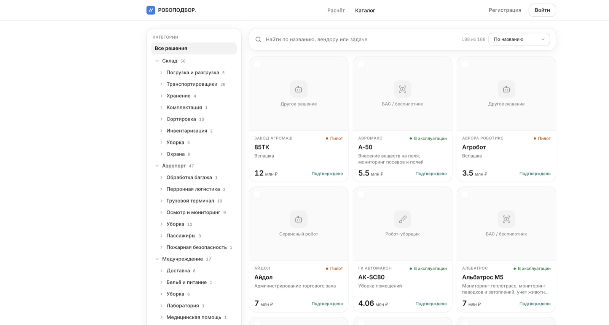

# РОБОПОДБОР

Независимый расчёт окупаемости роботизации — без комиссии вендора.

Каталог реальных решений → паспорт объекта → сценарии «как есть / покупка / аренда» → 3D-проверка склада или аэропорта → PDF и Excel для инвестиционного комитета.

## Запуск

Нужен только [Docker Desktop](https://www.docker.com/products/docker-desktop/).

```bash
git clone https://github.com/SoraLox/robopodbor.git
cd robopodbor
docker compose up --build
```

Сайт: <http://localhost:8080>  
Первая сборка ~4–6 минут. База, миграции, каталог и демо-пользователи поднимаются сами — `.env` не нужен.

| Роль | Почта | Пароль |
|---|---|---|
| Пользователь | `krylov@volga-logistic.ru` | `volga123` |
| Администратор | `admin@robotopodbor.ru` | `admin123` |

Без входа доступны каталог и полный расчёт.

Демо без Docker: [soralox.github.io/robopodbor](https://soralox.github.io/robopodbor/) (MSW-моки, без бэкенда).

<details>
<summary>Если что-то пошло не так</summary>

| Симптом | Что сделать |
|---|---|
| `Cannot connect to the Docker daemon` | Запустите Docker Desktop |
| Порт 8080 занят | Создайте `.env` со строкой `WEB_PORT=8090` и откройте <http://localhost:8090> |
| Падает `npm ci` / скачивание образов | Нужен интернет на первой сборке; проверьте VPN/прокси |
| Не хватает памяти | Docker Desktop → Resources → ≥ 4 ГБ |
| Сайт пустой | `docker compose logs migrate api` — сид должен закончиться «Сид базы данных выполнен» |
| После `git pull` старое | `docker compose up --build` |

Остановить: `Ctrl+C` или `docker compose down`. Чистая база: `docker compose down -v`.

</details>

---

<p align="center">
  <a href="https://soralox.github.io/robopodbor/"></a>
</p>

<p align="center">
  <a href="https://soralox.github.io/robopodbor/"><b>Открыть демо</b></a>
  ·
  <a href="https://soralox.github.io/robopodbor/#/catalog">Каталог</a>
  ·
  <a href="docs/README.md">Документация</a>
  ·
  <a href="contracts/openapi.yaml">OpenAPI</a>
</p>

## Что внутри

| | |
|---|---|
| **Каталог** | ~190 роботов с источником каждой цифры |
| **Подбор** | склад, аэропорт, клиника — от паспорта объекта |
| **Экономика** | горизонт 7 лет, CAPEX/OPEX, чувствительность |
| **Симуляция** | 3D-сцена склада и аэропорта по параметрам расчёта |
| **Отчёт** | PDF и Excel для защиты бюджета |

<p align="center">
  
</p>

## Структура

```
apps/web          интерфейс (React, Vite)
apps/api          API (Express, Prisma, Postgres)
contracts/        OpenAPI-контракт
docs/             документация и PDF-сборник
deploy/           Caddy / SSH-деплой
```

Подробнее: [docs/README.md](docs/README.md) · [docs/02-deploy.md](docs/02-deploy.md) · [docs/examples/](docs/examples/)
