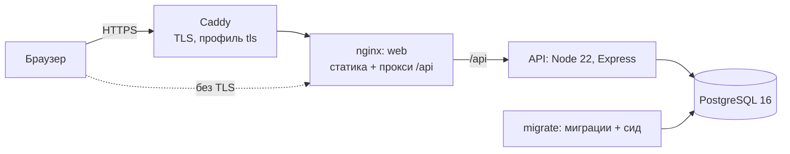
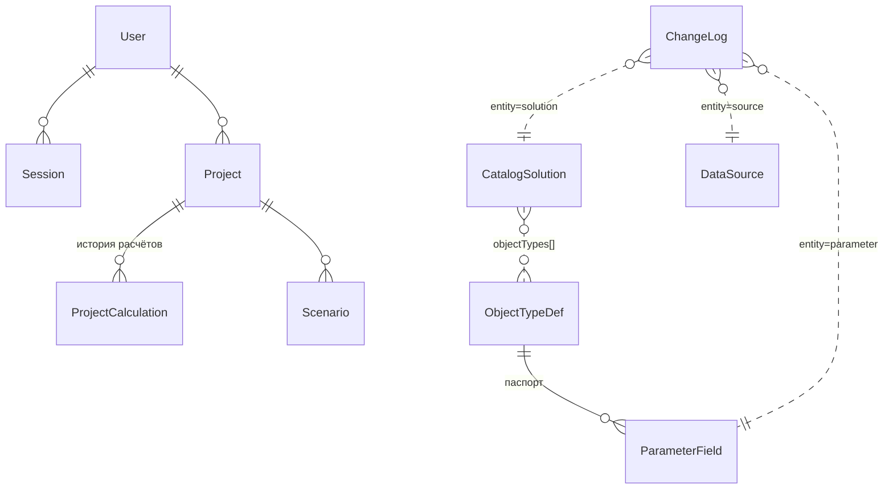

# 3. Архитектура, компоненты, данные и API (ТЗ 6.3)

## Компоненты

| Компонент | Технологии | Путь |
|---|---|---|
| Интерфейс | React 19, Vite, TanStack Query, Zustand, Tailwind, Radix UI, Recharts, three.js | `apps/web` |
| API | Node.js 22, Express 4, Prisma 6, zod, multer, SheetJS | `apps/api` |
| Общие доменные правила | TypeScript без зависимостей: каталог, подбор, паспорта, табличный импорт, версии | `apps/api/src/domain` |
| Контракт | OpenAPI 3.1, типы клиента генерируются из него | `contracts/openapi.yaml` |
| СУБД | PostgreSQL 16 | сервис `db` |
| Прокси | nginx: сжатие, кеш статики, заголовки безопасности, ограничение частоты запросов | `apps/web/nginx.conf` |

Правила подбора, проверки паспорта и описание каталога лежат в `apps/api/src/domain` и подключаются в интерфейс через псевдоним `@domain`. Поэтому сервер, демо-режим с моками MSW и подсказки в формах дают одинаковый результат.

### Расширяемость (ТЗ 4.2.6)

- **Новый тип объекта** — запись `ObjectTypeDef` и набор `ParameterField` в данных. Формы, шаблон Excel, импорт и проверка диапазонов строятся по этим записям.
- **Новый продукт или тип решения** — через админку, импорт таблицы или API каталога. Иерархия «отрасль → объект → процесс → тип решения → продукт» строится из полей решения (`buildTaxonomy`).
- **Новое правило подбора** — функция-проверка в `domain/selection.ts`. Версия правил (`SELECTION_RULES_VERSION`) возвращается вместе с подбором.
- **Расчётный модуль** подключается через контракт `CalculationResult`. Сохранение результата в проект — `POST /projects/{id}/calculations`, с указанием версии модели.

## Безопасность (ТЗ 4.4)

- Сессия хранится в httpOnly-cookie `sid`, запись сессии лежит в базе и имеет срок жизни.
- Пароли хранятся как соль + scrypt, открытого вида нет.
- Доступ по ролям: middleware `requireAuth` и `requireRole("admin")`. Проекты выбираются только по `userId` владельца (изоляция, 4.4.3).
- Удаление проекта каскадно удаляет его сценарии и историю расчётов. Загруженные файлы разбираются в памяти и на диск не пишутся (4.4.6).
- Заголовки безопасности (helmet и nginx), ограничение частоты запросов, HTTPS через Caddy.
- Из загружаемых xlsx читаются только значения ячеек: формулы и макросы не исполняются. Размер файла — до 5 МБ.

## Модель данных

| Таблица | Назначение |
|---|---|
| `User`, `Session` | Учётные записи (роль `user` или `admin`) и сессии |
| `Project` | Проект: тип объекта, значения паспорта, выбранные процессы и решение, последний снимок расчёта с `dataVersion`, `modelVersion`, `calculatedAt` |
| `ProjectCalculation` | История расчётов: каждый сохранённый результат вместе с паспортом, версией данных и версией модели (ТЗ 3.1.5) |
| `Scenario` | Сценарии проекта для списка и дашборда |
| `ObjectTypeDef` | Тип объекта: склад, аэропорт, медучреждение |
| `ParameterField` | Поле паспорта: подпись, единица, раздел, тип, диапазон, значение по умолчанию, обязательность, источник норматива |
| `CatalogSolution` | Решение каталога. Группы полей повторяют таблицу 3.3 ТЗ: идентификация, технические характеристики, ограничения для подбора, инфраструктура, экономика, применимость, качество данных |
| `DataSource` | Источник данных: тип, область, ссылка, дата актуализации, признак подтверждённости |
| `ChangeLog` | Журнал изменений справочников: кто, когда, что, до и после |

**Версия данных** — отметка времени последней записи в `ChangeLog` (или `data-seed` для исходного набора). **Версия модели** — идентификатор расчётной модели, выдавшей результат. Обе версии сохраняются в каждом снимке расчёта. Если справочники менялись после расчёта, это видно по версии, а сохранённый результат при повторном открытии не пересчитывается.

Схема базы — `apps/api/prisma/schema.prisma`, миграции — `apps/api/prisma/migrations`.

## API (ТЗ 3.8.2, 3.8.5)

Все пути начинаются с `/api`. Полное описание запросов, ответов и ошибок — в [`contracts/openapi.yaml`](../contracts/openapi.yaml). Контракт проходит проверку Redocly, и каждому маршруту сервера соответствует операция в контракте.

| Группа | Методы | Доступ |
|---|---|---|
| Здоровье | `GET /health` | все |
| Вход | `POST /auth/register`, `/auth/login`, `/auth/logout`, `GET /auth/session` | все |
| Типы объектов и паспорта | `GET /object-types`, `/object-types/{slug}/parameters`, `/object-types/{slug}/parameters/template`; `POST /object-types/{slug}/parameters/import` | все |
| Каталог | `GET /catalog/solutions`, `/catalog/taxonomy` | все |
| Каталог, изменение | `POST`, `PUT`, `DELETE /catalog/solutions[/{id}]`; `GET /catalog/solutions/export`; `POST /catalog/solutions/import` | админ |
| Подбор | `POST /selection` | все |
| Расчёт | `GET /calculations/{id}` — демо, проект или снимок из истории | все; чужие проекты недоступны |
| Проекты | `GET`, `POST /projects`; `GET`, `PATCH`, `DELETE /projects/{id}`; `POST /projects/{id}/copy`; `GET`, `POST /projects/{id}/calculations` | только владелец |
| Источники | `GET /sources`; `POST`, `PUT`, `DELETE /admin/sources[/{id}]` | чтение — все, запись — админ |
| Нормативы | `PATCH /admin/parameters/{fieldId}` | админ |
| Журнал | `GET /admin/changes?entity=&limit=` | админ |

Типы клиента пересобираются из контракта: `cd apps/web && npm run gen:api`.

## Производительность (ТЗ 4.3)

- Справочники (типы объектов, паспорта, каталог, дерево каталога) кешируются в памяти API на 60 секунд и сбрасываются сразу при правке. Браузер получает их с заголовками кеширования.
- Индексы: проекты по владельцу и дате, история по проекту и дате, GIN-индекс по типам объектов каталога.
- Тяжёлые части интерфейса (3D, графики, экспорт) загружаются отдельными чанками по требованию.
